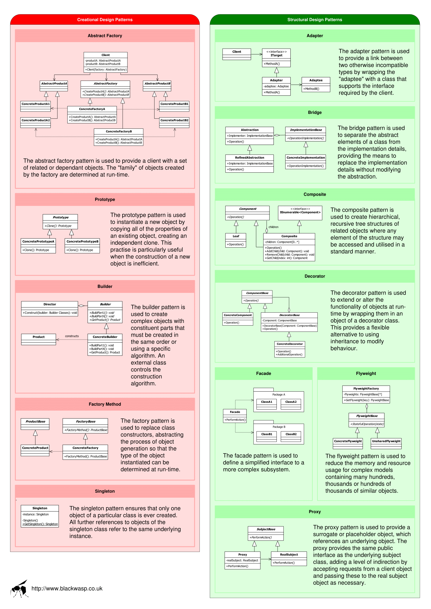
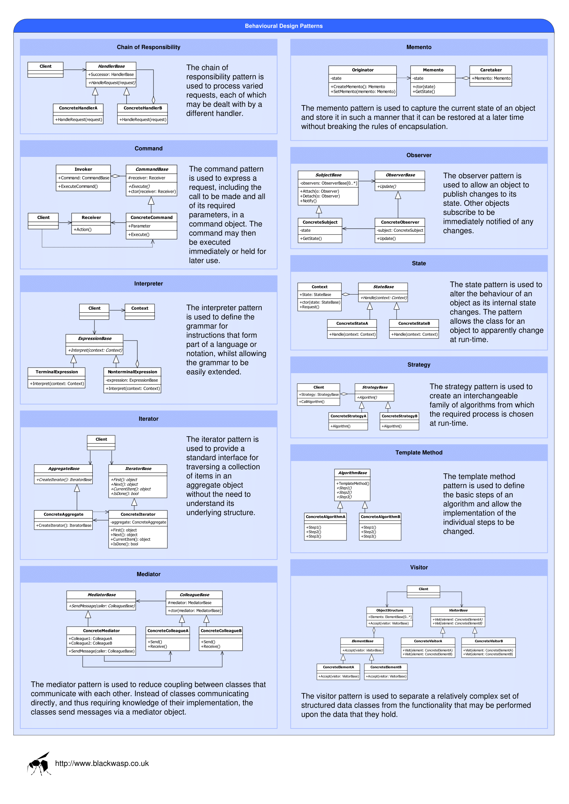

# Wzorce Projekotwe w Java

Wzorzec projektowy (ang. design pattern) – uniwersalne, sprawdzone w praktyce rozwiązanie często pojawiających się, powtarzalnych problemów projektowych. Pokazuje powiązania i zależności pomiędzy klasami oraz obiektami i ułatwia tworzenie, modyfikację oraz pielęgnację kodu źródłowego. Jest opisem rozwiązania, a nie jego implementacją. Wzorce projektowe stosowane są w projektach wykorzystujących programowanie obiektowe.

### Wzorce rozwiązań

Wzorce projektowe najczęściej tworzone są w oparciu o programowanie obiektowe. Zakres tego pojęcia stał się problemem rozważanym od połowy lat 90. XX wieku. Ostatecznie ustalono, że algorytmy nie są wzorcami projektowymi, jako że rozwiązują problemy obliczeniowe, a nie projektowe. Wzorce często są łączone w celu rozwiązania bardziej złożonego problemu.

Zamiast skupiać się na funkcjonowaniu poszczególnych elementów, wzorce projektowe stanowią abstrakcyjny opis zależności pomiędzy klasami, co w efekcie wprowadza pewną standaryzację kodu oraz zwiększa jego zrozumiałość, wydajność i niezawodność. Wartość wzorców projektowych stanowi nie tylko samo rozwiązanie problemu, ale także dokumentacja, która wyjaśnia cel, działanie, zalety danego rozwiązania, co pomaga w łatwiejszym stosowaniu i adaptacji wzorców w danym zastosowaniu.

Wzorce projektowe mogą przyspieszyć proces rozwoju oprogramowania przez dostarczenie wypróbowanych rozwiązań dla problemów, które mogą nie być oczywiste na początku procesu projektowego. Często zagadnienia te wiążą się rules ewolucją oczekiwań względem projektowanego systemu: rozszerzeniem jego funkcjonalności, zmianą sposobu i formatu wprowadzanych danych czy dostosowaniem aplikacji do różnych klas użytkowników. Nieuwzględnienie ich na początku procesu rozwoju produktu programistycznego powoduje często konieczność gruntownego przebudowywania zaawansowanego lub gotowego już oprogramowania.

### Klasyfikacja podstawowa

Wzorce możemy podzielić na trzy rodziny:

   - kreacyjne (konstrukcyjne) – opisujące proces tworzenia nowych obiektów; ich zadaniem jest tworzenie, inicjalizacja oraz konfiguracja obiektów, klas oraz innych typów danych;
   - strukturalne – opisujące struktury powiązanych ze sobą obiektów;
   - czynnościowe (behawioralne, operacyjne – opisujące zachowanie i odpowiedzialność współpracujących ze sobą obiektów.

[Wikipedia](https://pl.wikipedia.org/wiki/Wzorzec_projektowy_(informatyka))

------

### Creational Design Patterns: 

**Builder**

  Budowniczy (ang. Builder) – kreacyjny wzorzec projektowy, którego celem jest rozdzielenie sposobu tworzenia obiektów od ich reprezentacji. Innymi słowy proces tworzenia obiektu podzielony jest na kilka mniejszych etapów a każdy z tych etapów może być implementowany na wiele sposobów. Dzięki takiemu rozwiązaniu możliwe jest tworzenie różnych reprezentacji obiektów w tym samym procesie konstrukcyjnym: sposób tworzenia obiektów zamknięty jest w oddzielnych obiektach zwanych Konkretnymi Budowniczymi. Zazwyczaj stosowany jest do konstrukcji obiektów złożonych, których konfiguracja i inicjalizacja jest procesem wieloetapowym. Budowniczy różni się od wzorca fabryki abstrakcyjnej oraz pozostałych wzorców kreacyjnych tym, że skupia się na sposobie tworzenia obiektów reprezentujących produkty. Tworzy drobną część skomplikowanego produktu za każdym swoim wywołaniem jednocześnie kontrolując stan wykonanej pracy. Klient otrzymuje produkt po zakończeniu jego pracy, a nie – tak jak w przypadku Fabryki abstrakcyjnej – bezzwłocznie. W przypadku Fabryki abstrakcyjnej możliwe jest także tworzenie kilku obiektów jednocześnie. Często oba wzorce są łączone. Należy do grupy wzorców skatalogowanych przez Gang czworga.

  Wzorzec budowniczego stosowany jest do oddzielenia sposobu tworzenia obiektów od tego jak te obiekty mają wyglądać. Przykładem jest oprogramowanie konwertujące tekst z jednego formatu na drugi. Algorytm odczytujący i interpretujący dane wejściowe jest oddzielony od algorytmu tworzącego dane wyjściowe. Dzięki takiemu rozwiązaniu możliwe jest zastosowanie jednego obiektu odczytującego dane wejściowe oraz wielu obiektów konwertujących odczytane dane do różnych formatów (ASCII, HTML, RTF, itp.), co zwiększa uniwersalność rozwiązania.
  
  Różne warianty omawianego wzorca wykorzystywane są w bibliotece MFC, implementując architekturę dokument/widok. Obiekt klasy CDocument oraz jego podobiekty tworzone są poprzez wywołanie metody tworzącej z trzema parametrami typu CRuntimeClass. Klasa ta zawiera metodę CreateObject, umożliwiającą jej tworzenie obiektów różnych klas (m.in. CDocument, CFrameWnd oraz CView). Dzięki takiemu zachowaniu CRuntimeClass może być nazwana klasą Budowniczego.

  Standardowo wzorzec składa się z dwóch podstawowych obiektów. Pierwszy z nich oznaczony jest jako Budowniczy – jego celem jest dostarczenie interfejsu do tworzenia obiektów nazywanych w tym kontekście produktami. Drugim obiektem jest obiekt oznaczony jako Konkretny Budowniczy, a jego celem jest tworzenie konkretnych reprezentacji produktów przy pomocy zaimplementowanego interfejsu Budowniczego. W Konkretnym Budowniczym zawarte są procedury odpowiedzialne za konstrukcje i inicjalizację obiektu. Strukturę wzorca uzupełnia obiekt Kierownika (czasami nazywany także Dyrektorem, Nadzorcą), który zleca konstrukcję produktów poprzez obiekt Budowniczego dbając o to, aby proces konstrukcyjny przebiegał w odpowiedniej kolejności.
  Diagram sekwencji wzorca Budowniczy
  
  Dokładny przebieg procesu budowania przedstawia znajdujący się obok diagram sekwencji:
  
  - klient używający wzorca konstruuje obiekt budowniczego,
  - klient konstruuje nadzorcę, przekazując mu referencję do obiektu budowniczego, z którego ma korzystać,
  - klient zleca skonstruowanie produktu,
  - nadzorca zleca budowniczemu wykonanie w odpowiedniej kolejności wszystkich czynności niezbędnych do stworzenia produktu,
  - klient pobiera gotowy produkt od budowniczego.
      
  Zaletami stosowania wzorca są: duża możliwość zróżnicowania wewnętrznych struktur klas, większa możliwość kontrolowania tego, w jaki sposób tworzony jest obiekt (proces konstrukcyjny jest niezależny od elementów, z których składa się tworzony obiekt) oraz duża skalowalność (dodawanie nowych reprezentacji obiektów jest uproszczone). Stosowanie wzorca zapobiega także tworzeniu zduplikowanego kodu odpowiedzialnego za tworzenie obiektów, gdyż proces tworzenia konkretnych elementów obiektów zamknięty jest w poszczególnych procedurach.Wady to duża liczba obiektów reprezentujących konkretne produkty.    

  Wzorcem podobnym do Budowniczego jest fabryka abstrakcyjna, której celem jest tworzenie grupy produktów. Wzorzec Budowniczego często jest także stosowany do tworzenia obiektów we wzorcu kompozyt. Inne podobne wzorce to metoda wytwórcza oraz metoda szablonowa.

**Factories**

  Fabryka abstrakcyjna (ang. Abstract Factory) – kreacyjny wzorzec projektowy, którego celem jest dostarczenie interfejsu do tworzenia różnych obiektów jednego typu (tej samej rodziny) bez specyfikowania ich konkretnych klas. Umożliwia jednemu obiektowi tworzenie różnych, powiązanych ze sobą, reprezentacji podobiektów określając ich typy podczas działania programu. Fabryka abstrakcyjna różni się od Budowniczego tym, że kładzie nacisk na tworzenie produktów z konkretnej rodziny, a Budowniczy kładzie nacisk na sposób tworzenia obiektów.
  
  Rozpatrzmy aplikację kliencką, która łączy się ze zdalnym serwerem. Celem projektanta takiej aplikacji jest to, aby była ona przenośna. Jednym z rozwiązań takiego problemu jest stworzenie fabryki, która będzie tworzyła odpowiednie obiekty w zależności od tego na jakiej platformie się znajduje.
  
  Jak widać na załączonym diagramie klas wzorzec zbudowany jest z kilku podstawowych klas. Klasa Fabryka abstrakcyjna deklaruje abstrakcyjny interfejs umożliwiający tworzenie produktów. Interfejs ten jest implementowany w Fabrykach konkretnych, które odpowiedzialne są za tworzenie konkretnych produktów. Każda fabryka konkretnego produktu posiada także metodę wytwórczą tego produktu.
  
  Jednym z plusów wykorzystania wzorca jest możliwość ukrycia szczegółów implementacyjnych klas reprezentujących konkretny produkt - klient widzi tylko interfejs. Ukryciu ulegają także nazwy tych klas, co nie wymusza ich zapamiętywania i odizolowuje klienta od problemu określenia do której klasy należy obiekt.
  
  Do zysków należy także możliwość całkowitego ukrycia implementacji obiektów przed klientem. Klient widzi tylko interfejs i nie ma możliwości zajrzenia do kodu oraz to, że wymuszana jest spójność produktów.
  
  Do minusów należy zaliczyć trudność rozszerzania rodziny obiektów o nowe podobiekty. Wymusza to modyfikację klasy fabryki abstrakcyjnej oraz wszystkich obiektów, które są tworzone przez nią.

**Prototype** 

  Prototyp – kreacyjny wzorzec projektowy, którego celem jest umożliwienie tworzenia obiektów danej klasy bądź klas z wykorzystaniem już istniejącego obiektu, zwanego prototypem. Głównym celem tego wzorca jest uniezależnienie systemu od sposobu w jaki tworzone są w nim produkty.
  
  Omawiany wzorzec stosujemy między innymi wtedy, gdy nie chcemy tworzyć w budowanej aplikacji podklas obiektu budującego (jak to jest w przypadku wzorca fabryki abstrakcyjnej). Wzorzec ten stosujemy podczas stosowania klas specyfikowanych podczas działania aplikacji.
  
  Wzorzec prototypu określa rodzaj obiektów do tworzenia za pomocą prototypowej instancji. Prototypy nowych produktów są często budowane przed pełną produkcją, ale w tym przykładzie, prototyp jest bierny i nie bierze udziału w kopiowaniu siebie samego. Przykładem aktywnego prototypu (czyli biorącego udział w kopiowaniu siebie samego) jest biologiczny podział jednej komórki w dwie identyczne. Wtedy mamy do czynienia z klonowaniem.
  
  Czasem wzorce konstrukcyjne pokrywają się. Są przypadki, gdzie odpowiedni byłby zarówno Prototyp, jak i Fabryka Abstrakcyjna. W innych przypadkach te wzorce nawzajem się uzupełniają: Fabryka abstrakcyjna mogłaby przechowywać zbiór Prototypów, które mogłaby klonować i zwracać jako obiekt produktu. Fabryka abstrakcyjna, Budowniczy i Prototyp mogą w swych implementacjach używać wzorca Singletonu. Klasy Fabryki abstrakcyjnej są często implementowane razem z Metodami fabrykującymi (tworzenie przez dziedziczenie), ale mogą być też implementowane przy użyciu Prototypu (tworzenie przez delegację). Często projekty startują wraz z użyciem Metod fabrykujących (które są mniej skomplikowane, bardziej elastyczne i z szybko powiększającą się liczbą podklas) i ewoluują w kierunku Fabryki abstrakcyjnej, Prototypu lub Budowniczego (o większych możliwościach i bardziej złożonych) wtedy, gdy projektant uzmysłowi sobie potrzebę stosowania rozwiązań o większej mocy. Prototypy nie wymagają "podklasowania", ale wymagają operacji inicjalizacji. Metody fabrykujące wymagają "podklasowania" ale nie wymagają inicjalizacji. Projekty, które intensywnie używają wzorca Kompozytu i Dekoratora, mogą równie dobrze odnieść korzyść ze stosowania Prototypu. Praktyczną wskazówką na to, kiedy może być potrzebnym używanie metody clone(), jest konieczność tworzenia prawdziwej kopii (ang. true copy) innej instancji w czasie wykonywania programu. Prawdziwa kopia to taka, w której skopiowany obiekt ma wszystkie swe pola identyczne z pierwowzorem. Gdy używa się operatora new, to wtedy te pola mają wartości początkowe. Przykładowo, jeśli projektuje się system do przeprowadzania transakcji bankowych, to wtedy potrzebna jest taka kopia obiektu, która przechowa dane konta, wykona transakcje na tej kopii i zamieni tę kopię z oryginałem. W takim przypadku potrzebna jest raczej metoda clone() niż operator new. 

**Singleton**

  Singleton – kreacyjny wzorzec projektowy, którego celem jest ograniczenie możliwości tworzenia obiektów danej klasy do jednej instancji oraz zapewnienie globalnego dostępu do stworzonego obiektu. Niekiedy wzorzec uogólnia się do przypadku wprowadzenia pewnej maksymalnej liczby obiektów, jakie mogą istnieć w systemie. Niektórzy programiści uznają go za antywzorzec, ponieważ łamie zasady projektowania obiektowego, często bywa nadużywany lub sprowadza się do stworzenia obiektowego zamiennika dla zmiennej globalnej.
  
  Rozważmy aplikację prowadzącą dla celów diagnostycznych dziennik zdarzeń. Poszczególne komponenty dodają wpis do dziennika, przekazując mu jego treść, natomiast dziennik określa, gdzie faktycznie zostanie on zapisany.
  
  - Każdy komponent może uzyskać w dowolnym momencie dostęp do dziennika, zatem musi on być dostępny globalnie.
  - To dziennik decyduje o tym, gdzie wpis zostanie faktycznie zapisany. Komponent musi jedynie przekazać jego treść. Oznacza to istnienie pojedynczej instancji dziennika.
  - Z dziennika mogą również korzystać komponenty wielokrotnego użytku, zatem nie powinny one być zależne od mechanizmów udostępniania zasobów specyficznych dla danej aplikacji.
  
  Możemy to zapewnić, implementując w dzienniku wzorzec singleton tak, aby mógł on we własnym zakresie zarządzać dostępem do siebie samego.
  
  Singleton implementuje się przez stworzenie klasy, która posiada statyczną metodę, która najpierw sprawdza, czy istnieje już instancja tej klasy, w razie potrzeby tworząc ją. Następnie instancja zwracana jest przez referencję. Instancję przechowuje się w prywatnym lub chronionym, statycznym polu, do którego dostęp ma tylko opisana wyżej metoda, która jest jedyną drogą pozyskania instancji obiektu singletonu – aby uniemożliwić tworzenie dodatkowych instancji, konstruktor klasy deklaruje się jako prywatny lub chroniony.
  
  Cały proces jest niewidoczny dla użytkownika. Nie musi on wiedzieć, czy instancja już istnieje czy dopiero jest tworzona. Jeśli żaden komponent nie będzie wykorzystywać klasy, system nie przydzieli jej zasobów.
  
  Zalety:
  
  - singleton nie musi ograniczać się do obsługi pojedynczej instancji klasy – przy niewielkiej zmianie podejścia można za jego pomocą zarządzać także większą liczbą obiektów,
  - klasa zaimplementowana z użyciem wzorca singleton może samodzielnie kontrolować liczbę swoich instancji istniejących w systemie,
  - proces pobierania instancji klasy jest niewidoczny dla użytkownika. Nie musi on wiedzieć, czy w chwili wywołania metody instancja istnieje czy dopiero jest tworzona,
  - tworzenie nowej instancji ma charakter leniwy, tj. zachodzi dopiero przy pierwszej próbie użycia. Jeśli żaden komponent nie zdecyduje się korzystać z klasy, jej instancji nie będą niepotrzebnie przydzielone zasoby.
  
  Wady:
  
  - brak elastyczności, bo już na poziomie kodu jest na sztywno określona liczba instancji, jakie mogą istnieć w systemie
  - poważnie utrudnia testowanie aplikacji przez wprowadzenie do niej globalnego stanu[5]
  - łamie zasadę jednej odpowiedzialności
  - łamie zasadę otwarte-zamknięte
  - nie można go rozszerzyć
  
  Singleton musi być ostrożnie stosowany w systemach wielowątkowych. Zażądanie instancji klasy przez dwa wątki równocześnie może doprowadzić do utworzenia dwóch niezależnych instancji, dlatego metoda dostępowa powinna być wtedy zaimplementowana z wykorzystaniem wzajemnego wykluczania.

### Structrural Design Patterns:

**Adapter**

  Adapter (także: opakowanie, ang. wrapper) – strukturalny wzorzec projektowy, którego celem jest umożliwienie współpracy dwóm klasom o niekompatybilnych interfejsach. Adapter przekształca interfejs jednej z klas na interfejs drugiej klasy. Innym zadaniem omawianego wzorca jest opakowanie istniejącego interfejsu w nowy.
  
  Wzorzec adaptera stosowany jest najczęściej w przypadku, gdy wykorzystanie istniejącej klasy jest niemożliwe ze względu na jej niekompatybilny interfejs. Drugim powodem użycia może być chęć stworzenia klasy, która będzie współpracowała z klasami o nieokreślonych interfejsach.
  
  Istnieją dwa warianty wzorca Adapter: _klasowy, obiektowy_.
  
  Różnią się one nieznacznie budową oraz właściwościami. Do stworzenia adaptera klasowego wykorzystywane jest wielokrotne dziedziczenie. Klasa adaptera dziedziczy prywatnie po klasie adaptowanej oraz publicznie implementuje interfejs klienta. W przypadku tego adaptera wywołanie funkcji jest przekierowywane do bazowej klasy adaptowanej.
  
  W przypadku adaptera obiektowego klasa adaptera dziedziczy interfejs, którym posługuje się klient oraz zawiera w sobie klasę adaptowaną. Rozwiązanie takie umożliwia oddzielenie klasy klienta od klasy adaptowanej. Komplikuje to proces przekazywania żądania: klient wysyła je do adaptera wywołując jedną z jego metod. Następnie adapter konwertuje wywołanie na jedno bądź kilka wywołań i kieruje je do obiektu/obiektów adaptowanych. Te przekazują wyniki działania bezpośrednio do klienta.

  Zadaniem adaptera dwukierunkowego jest adaptowanie interfejsów klienta oraz adaptowanego. Dzięki takiemu rozwiązaniu każda z klas może pełnić zarówno funkcję klienta jak i adaptowanego. Ten typ adaptera można zaimplementować tylko za pomocą wielokrotnego dziedziczenia.
  
  Konsekwencje stosowania wzorca są różne w zależności od tego, z jakim typem mamy do czynienia. W przypadku typu klasowego są to:
  
  - brak możliwości adaptowania klasy wraz z jej podklasami,
  - możliwość przeładowania metod obiektu adaptowanego.
  
  Do konsekwencji stosowania adaptera obiektowego należą:
  
  - możliwość adaptacji klasy wraz z jej podklasami (związane jest to z wykorzystaniem składania obiektów),
  - możliwość dodawania nowej funkcjonalności,
  - brak możliwości przeładowania metod obiektu adaptowanego.
  
  W obu przypadkach należy liczyć się z narzutem wydajnościowym — tym większym, im większa jest niekompatybilność interfejsów. 

**Bridge**

  Wzorzec mostu (ang. Bridge pattern) – strukturalny wzorzec projektowy, który pozwala oddzielić abstrakcję obiektu od jego implementacji.
  
  Zaleca się stosowanie tego wzorca aby:
  
  - odseparować implementację od interfejsu,
  - poprawić możliwości rozbudowy klas, zarówno implementacji, jak i interfejsu (m.in. przez dziedziczenie),
  - ukryć implementację przed klientem, co umożliwia zmianę implementacji bez zmian interfejsu.

**Composite**

  Kompozyt – strukturalny wzorzec projektowy, którego celem jest składanie obiektów w taki sposób, aby klient widział wiele z nich jako pojedynczy obiekt.
  
  Wzorzec ten stosuje się, gdy wygodniej jest korzystać z pewnych operacji dla danego obiektu w ten sam sposób jak dla grupy obiektów, np. rysując na ekranie prymitywy lub obiekty złożone z prymitywów; zmieniając rozmiar zarówno pojedynczych prymitywów jak i obiektów złożonych z prymitywów (z zachowaniem proporcji).
  
  Wzorzec wyróżnia następujące elementy:
  
  - Component - klasa abstrakcyjna reprezentująca pojedyncze obiekty Leaf, jak i kontenery tych obiektów.
  - Leaf - typ prosty - nie posiada potomków.
  - Composite - przechowuje obiekty proste (Leaf), implementuje zachowanie elementów które zawiera.
  
  Composite jak i Leaf dziedziczy po tym samym interfejsie co pozwala na dostęp do obiektów prostych w ten sam sposób jak do grupy tych obiektów. Użytkownik może przeprowadzać operacje na pojedynczym obiekcie, jak i na grupie obiektów reprezentowanych tym wzorcem. Zgodnie z oryginalnym opisem wzorca, zarówno klasa Component jak i Composite zawiera metody operujące na komponentach podrzędnych, które są przechowywane w klasie Composite. Nowsze opisy umieszczają te metody tylko w klasie Composite.

  - Umożliwia definiowanie hierarchii z obiektów prostych i złożonych
  - Upraszcza kod klientów
  - Ułatwia dodawanie komponentów nowego rodzaju
  - Może sprawić, że projekt stanie się zanadto ogólny

**Decorator**

  Dekorator – wzorzec projektowy należący do grupy wzorców strukturalnych. Pozwala na dodanie nowej funkcji do istniejących klas dynamicznie podczas działania programu.
  
  Wzorzec dekoratora polega na opakowaniu oryginalnej klasy w nową klasę "dekorującą". Zwykle przekazuje się oryginalny obiekt jako parametr konstruktora dekoratora, metody dekoratora wywołują metody oryginalnego obiektu i dodatkowo implementują nową funkcję.
  
  Dekoratory są alternatywą dla dziedziczenia. Dziedziczenie rozszerza zachowanie klasy w trakcie kompilacji, w przeciwieństwie do dekoratorów, które rozszerzają klasy w czasie działania programu.
  
  Ponieważ w większości obiektowych języków programowania nie można tworzyć nowych klas podczas działania programu i zwykle nie można przewidzieć z góry wszystkich kombinacji rozszerzeń klas, konieczne by było stworzenie nowej klasy dla każdej kombinacji. Dekoratory są obiektami tworzonymi w czasie działania programu i mogą być łączone w różne kombinacje bezpośrednio przy użyciu. 
  
  Rozważmy okno w graficznym interfejsie użytkownika. By pozwolić na przewijanie jego zawartości, należy dodać do niego poziome lub pionowe paski przewijania. Okna są reprezentowane przez instancję klasy Okno i klasa ta nie powinna posiadać żadnych metod dodających paski przewijania. Można utworzyć podklasę PrzewijaneOkno, która udostępniałaby te metody lub stworzyć OknoDekoratorPrzewijane, który jedynie dodawałby tę funkcję do istniejących obiektów Okno. W tym miejscu działałyby oba rozwiązania.
  
  Teraz załóżmy, że potrzeba dodać ramki dookoła okien. I w tym przypadku klasa Okno nie ma takiej funkcji. Pojawia się problem z podklasą PrzewijaneOkno, bo aby dodać ramki do wszystkich okien potrzeba stworzyć podklasy OknoZRamką i OknoPrzewijaneZRamką. Problem staje się jeszcze większy z każdą kolejną opcją. W przypadku dekoratorów wystarczy stworzyć jedną klasę OknoDekoratorRamka - podczas działania programu można dynamicznie dekorować istniejące okna z OknoDekoratorPrzewijane lub OknoDekoratorRamka lub oboma.
  
  Przykładem zastosowania wzorca dekoratora jest implementacja strumieni I/O w Javie. 
  
  - Zapewnia większą elastyczność niż statyczne dziedziczenie.
  - Pozwala uniknąć tworzenia przeładowanych funkcjami klas na wysokich poziomach hierarchii.
  - Dekorator i powiązany z nim komponent nie są identyczne.
  - Powstawanie wielu małych obiektów.

**Façade**

  Fasada – wzorzec projektowy należący do grupy wzorców strukturalnych. Służy do ujednolicenia dostępu do złożonego systemu poprzez wystawienie uproszczonego, uporządkowanego interfejsu programistycznego, który ułatwia jego użycie. 
  
  Rozważmy kompilator napisany z wykorzystaniem reguł programowania obiektowego. Znajdują się w nim klasy i obiekty reprezentujące Analizator składniowy, lekser, bufory na kod wynikowy i wiele innych elementów. Interfejs całego systemu posiada duże możliwości, lecz jest skomplikowany, tymczasem większość jego użytkowników będzie zainteresowana po prostu uruchomieniem kompilacji określonego pliku i pobrania wyniku. Rozwiązaniem jest zastosowanie wzorca Fasada do stworzenia dodatkowego obiektu, który pozwala szybko uruchomić najbardziej typowe zadania, jednocześnie nie ukrywając złożoności systemu przed tymi, którzy jej faktycznie potrzebują. 
  
  Wzorzec wyróżnia następujące elementy:
  
  - złożony system – reprezentowany na diagramie przez klasy Element1 do Element5. Chcemy uprościć dostęp do niego,
  - fasada – klasa posiadająca referencje do elementów systemu z metodami do wykonywania najczęściej potrzebnych zadań,
  - klient – dowolny kod zainteresowany wykorzystaniem złożonego systemu.
  
  Klient komunikuje się z systemem poprzez fasadę, która w jego imieniu wykonuje niezbędne operacje na złożonym systemie. To, czy klient posiada także bezpośredni dostęp do systemu, leży w gestii programisty implementującego wzorzec, ponieważ możliwe jest wykorzystanie go do podziału systemu na warstwy, gdzie fasady służą do uproszczenia i ujednolicenia komunikacji. 
 
  - duże zmniejszenie liczby zależności między klientem a złożonym systemem — jeśli klient nie korzysta bezpośrednio z żadnych elementów ukrytych za fasadą systemu, całość jest łatwiejsza w konserwacji i utrzymaniu,
  - wprowadzenie podziału aplikacji na warstwy, który ułatwia niezależny rozwój klienta i złożonego systemu,
  - możliwość zablokowania klientowi drogi do bezpośredniego korzystania ze złożonego systemu, jeśli jest to konieczne,
  - kod klienta wykorzystującego fasadę jest czytelniejszy i łatwiejszy w zrozumieniu.
      
  Przykładem użycia wzorca fasady może być aplikacja bankomatowa, która musi wchodzić w interakcję z systemem bankowym. Skoro aplikacja bankomatowa wykorzystuje tylko niewielką część możliwości systemu bankowego (autoryzacja karty, sprawdzenie stanu konta, wypłata i ew. wpłata), to można zastosować obiekt fasady, który zasłoni przed zewnętrznymi aplikacjami skomplikowaną strukturę wewnętrzną systemu bankowego. Upraszcza to pisanie aplikacji na bankomaty, a jednocześnie zapewnia lepsze bezpieczeństwo systemu bankowego.    
 
**Flyweight**

  Pyłek (ang. Flyweight) – strukturalny wzorzec projektowy, którego celem jest zmniejszenie wykorzystania pamięci poprzez poprawę efektywności obsługi dużych obiektów zbudowanych z wielu mniejszych elementów poprzez współdzielenie wspólnych małych elementów. Należy do grupy wzorców skatalogowanych przez Gang of Four. 

  Wzorzec Pyłek stosuje się tam, gdzie jedna klasa ma wiele egzemplarzy, a każdy z tych egzemplarzy może być sterowany w ten sam sposób. Przykładowo tenże wzorzec można zastosować w programie wspomagającym modelowanie przestrzenne terenu. Jednym z wielu elementów, które muszą się w nim znaleźć są obiekt reprezentujący drzewo. Zakładamy, że obiekt taki posiada informacje o wyglądzie drzewa oraz jakieś inne jego cechy, przy czym także jego wysokości oraz jego współrzędne położenia. Podczas modelowania wielkich kompleksów zieleni złożonych z wielu egzemplarzy drzewa program może zacząć działać niezadowalająco wolno. Aby uporać się z takim problemem można zastosować wzorzec Pyłek. Po zastosowaniu tego wzorca projektowego zamiast tworzyć indywidualny egzemplarz klasy (obiekt) dla każdego drzewa możliwe jest stworzenie kompleksowego obiektu, który będzie w sobie zawierał informacje o wszystkich drzewach renderowanych na modelowanym terenie. W takim obiekcie z racji tego, że wszystkie renderowane drzewa mają pewne cechy wspólne, takie jak np. wygląd, informacje te będą zapisane tylko raz (choć drzew może być tysiące), a zwielokrotniane będą jedynie informacje różne dla każdego drzewa tak jak np. współrzędne i wysokość. Sposób wykonania tej idei oraz jej implementacja zależy od woli programisty. 

  Istotą wzorca jest podział danych przechowywanych w ciężkim obiekcie na wewnętrzne i zewnętrzne. Do klasy danych wewnętrznych wybierane są te składowe ciężkiej klasy pierwotnej, których wartości często się powtarzają. Pozostałe składowe stanowią dane zewnętrzne. Po ustaleniu podziału zamiast ciężkich obiektów wzorzec wprowadza odpowiadające im obiekty klientów oraz tzw. obiekty pyłków. Obiekty pyłków są tworzone z wybranych wcześniej danych wewnętrznych. Każdy z nich jest współdzielony przez wielu klientów i nie można go modyfikować. Dane zewnętrzne, unikatowe dla każdego obiektu klienta, są dostarczane obiektowi pyłku poprzez określone metody. Wzorzec zawiera dwóch uczestników - Fabrykę Pyłków i Pyłek. Klient nie tworzy egzemplarzy typu Pyłek samodzielnie, a jedynie wysyła do Fabryki żądanie ich udostępnienia. Fabryka zwraca Klientowi istniejący Pyłek lub tworzy nowy, jeśli żaden egzemplarz tej klasy jeszcze nie istnieje. 
  
  Ideą wzorca projektowego pyłek jest stworzenie prostego mechanizmu współdzielenia obiektu o niewielkim rozmiarze przez wiele obiektów w celu zwiększenia wydajności systemu pod względem zużycia pamięci. Zamiast zapisywać oddzielnie kilka olbrzymich obiektów, dzielmy owe obiekty na mniejsze składowe i elementy które się w nich powtarzają zapisujemy tylko raz,a nie kilka razy. Mówiąc inaczej pyłek ma na celu udostępnianie pojedynczego małego obiektu wielu klientom(dużym obiektom). Implementując ten wzorzec projektowy należy rozwiązać problem wspólnego dostępu do współdzielonych danych. Jednym ze sposobów realizacji tego mechanizmu jest podział danych przechowywanych w atrybutach obiektów (te mniejsze elementy) na współdzielone dane wewnętrzne intrinsicState oraz niewspółdzielone, unikatowe dla każdego obiektu dane zewnętrzne allState. Czyli dwie grupy złożone z małych elementów.
  
  Wzorzec ten można formalnie zrealizować za pomocą trzech głównych elementów: 
            
   - elementu abstrakcyjnego Flyweight definiującego operacje służące do przyjmowania i odtwarzania stanu zewnętrznego obiektu opisywanego przez klasę UnsharedConcreteFlyweight
   - obiektu tworzonego na bazie klasy ConcreteFlyweight przechowującego stan wewnętrzny (współdzielony) obiektu, który dodatkowo jest niezależny od kontekstu wywołania
   - fabryki FlyweightFactory, której zadaniem jest kreowanie i składowanie obiektów realizujących interfejs Flyweight
   
  Kompozyt jest często używany wraz z Pyłkiem, by zaimplementować współdzielone liście w strukturze drzewa. Pyłek objaśnia czy i w jakich warunkach obiekt typu Stan może być współdzielony. Podczas gdy Pyłek pokazuje, jak utworzyć mnóstwo małych obiektów składających się na jeden, lub kilka(-nascie, -dziesiąt) większych, Fasada pokazuje jak utworzyć jeden obiekt reprezentujący cały złożony podsystem.  

**Proxy**

  Pełnomocnik (ang. proxy) – strukturalny wzorzec projektowy, którego celem jest utworzenie obiektu zastępującego inny obiekt. Stosowany jest w celu kontrolowanego tworzenia na żądanie kosztownych obiektów oraz kontroli dostępu do nich. 
  
  Istnieją cztery rodzaje tego wzorca, które jednocześnie definiują sytuacje, w których może zostać użyty:
  
  - wirtualny – przechowuje obiekty, których utworzenie jest kosztowne; tworzy je na żądanie
  - ochraniający – kontroluje dostęp do obiektu sprawdzając, czy obiekt wywołujący ma odpowiednie prawa do obiektu wywoływanego
  - zdalny – czasami nazywany ambasadorem; reprezentuje obiekty znajdujące się w innej przestrzeni adresowej
  - sprytne odwołanie – czasami nazywany sprytnym wskaźnikiem; pozwala na wykonanie dodatkowych akcji podczas dostępu do obiektu, takich jak: zliczanie referencji do obiektu czy ładowanie obiektu do pamięci

### Behavioral Design Patterns:

**Chain of Responsibility** 

  Łańcuch zobowiązań (ang. Chain of responsibility, niekiedy tłumaczony także jako Łańcuch odpowiedzialności – czynnościowy wzorzec projektowy, w którym żądanie może być przetwarzane przez różne obiekty, w zależności od jego typu.
  
  Rozpatrzmy przykładowy komponent systemu, który przetwarza żądania przychodzące od innych komponentów. Każde żądanie ma określony typ, lub daje się zaklasyfikować do jakiejś kategorii. W zależności od typu, żądania mają być przetwarzane w odmienny sposób. Pragniemy zaimplementować mechanizm przetwarzania żądań, który umożliwiłby łatwe dodawanie w przyszłości obsługi nowych typów oraz ich usuwanie w razie potrzeby.
  
  Wzorzec Łańcuch zobowiązań zakłada utworzenie oddzielnej klasy dla każdej procedury obsługi żądania dziedziczącej po pewnej klasie bazowej AbstrakcyjnaObsluga. Obiekt każdej z procedur może posiadać wskazanie na następnik, tworząc w ten sposób łańcuch procedur przetwarzania. Aby przetworzyć żądanie, wykonujemy metodę operacja() na pierwszym elemencie łańcucha. Jeśli nie potrafi on przetworzyć żądania, powinien przekazać je swojemu następnikowi: 
  
  Konsekwencje użycia:
  
  Zalety:
  
  - elementy łańcucha mogą być dynamicznie dodawane i usuwane w trakcie działania programu,
  - zmniejszenie liczby zależności między nadawcą a odbiorcami,
  - implementacja pojedynczej procedury nie musi znać struktury łańcucha oraz innych procedur.
  
  Wady:
  
  - wzorzec nie gwarantuje, że każde żądanie zostanie obsłużone,
  - śledzenie i debugowanie pracy działania łańcucha może być trudne.
  
  Zastosowanie:
  
  Wzorzec znajduje zastosowanie wszędzie tam, gdzie mamy do czynienia z różnymi mechanizmami podobnych żądań, które można zaklasyfikować do różnych kategorii. Dodatkową motywacją do jego użycia są często zmieniające się wymagania.
  
  Rozpatrzmy drzewo dokumentu (DOM). Każdy element może mieć elementy - dzieci, oraz ma swój element - rodzica w którym się zawiera (poza elementem głównym - rootem).
  
  Użytkownik klika na któryś z elementów w drzewie. Jest to zarówno kliknięcie na ten element, jak i na elementy w których się znajduje ten element (rodziców - ponieważ znajdują się pod klikniętym elementem i kliknięcie może również dotyczyć ich). Elementy mogą mieć handler dla zdarzenia click - lub nie. Jeżeli obiekt posiada handler, obsługuje kliknięcie, i propagacja się kończy. Jeżeli handler uzna, że nie jest w stanie obsłużyć zdarzenia i zostanie wywołana odpowiednia metoda powodująca propagację wyżej, lub jeżeli obiekt nie posiada handlera, zdarzenie jest propagowane do rodzica klikniętego elementu. Cykl się powtarza dla rodzica - znowu, jeżeli potrafi on obsłużyć zdarzenie to propagacja się kończy, jeżeli nie, zdarzenie jest propagowane wyżej i wyżej, tak długo aż któryś z obiektów je obsłuży, lub propagacja osiągnie root element. 

**Command**

  Polecenie (ang. Command, komenda) – czynnościowy wzorzec projektowy, traktujący żądanie wykonania określonej czynności jako obiekt, dzięki czemu mogą być one parametryzowane w zależności od rodzaju odbiorcy, a także umieszczane w kolejkach i dziennikach.

  Rozpatrzmy typową aplikację okienkową realizującą jakieś zadanie. Użytkownik może wykonać w niej różne czynności. Chcemy umożliwić mu cofanie zmian oraz przeglądanie ich historii, dlatego niezbędny jest nam mechanizm, który oprócz obsługi żądań, będzie je także zapamiętywał na stosie.

  Wzorzec Polecenie zakłada utworzenie oddzielnej klasy dla każdego zadania implementującej pewien wspólny interfejs Polecenie. Mamy także stronę generującą zadania do wykonania (nadawca), którą może być kod obsługi zdarzeń myszki i klawiatury, a także jeden lub więcej obiektów odpowiedzialnych za obsługę poleceń (odbiorca). Aby wykonać operację, nadawca tworzy obiekt określonego zadania i przekazuje go do wybranego odbiorcy, który odpowiada za wywołanie metody wykonaj().

  Dopuszczalne jest parametryzowanie polecenia przed jego wykonaniem, zarówno po stronie odbiorcy, jak i nadawcy. Dodatkowo, odbiorca może zapamiętać obiekt polecenia na stosie, oferując programowi usługę wycofywania operacji lub przeglądania historii. Wspólny interfejs Polecenie musi być wtedy rozszerzony o dodatkowe metody takie, jak ustawParametr() czy wycofaj().

  Wykaz elementów składowych wzorca:

  - polecenie — interfejs definiujący operacje, jakie musi obsługiwać każde polecenie (wykonywanie zadania, wycofywanie zmian itd.)
  - konkretne polecenie — klasa dostarczająca implementacji interfejsu polecenia, koncentrująca się na obsłudze pojedynczego zadania. Dla każdego rodzaju obsługiwanego polecenia tworzymy oddzielną klasę.
  - model — dowolny obiekt, na którym polecenia potrafią wykonać operacje. W praktyce w skład modelu może wchodzić dowolnie duża liczba klas i obiektów.
  - nadawca — dowolny obiekt, który potrafi generować obiekty poleceń.
  - odbiorca — obiekt wykonujący polecenia poprzez wywołanie metody wykonaj() na przekazanym do niego obiekcie. Oprócz tego, może wykonać dodatkowe operacje związane z jego obsługą (np. zapisanie polecenia w dzienniku lub historii zmian).

  Zalety:

  - oddzielenie operacji od obiektów, na których jest ona wykonywana,
  - polecenia są reprezentowane jako standardowe obiekty, dzięki czemu możemy na nich stosować wszystkie manipulacje dopuszczalne w programowaniu obiektowym,
  - możliwość łączenia elementarnych poleceń w polecenia złożone,
  - łatwość dodawania nowych rodzajów poleceń.

  Wady:

  - każde polecenie wymaga dodatkowej pamięci na zapamiętanie stanu swojego obiektu.

  Implementacja wzorca wymaga przeanalizowania następujących kwestii:

  - stopień skomplikowania polecenia — jak dużą odpowiedzialność powinny mieć polecenia? Czy będą to jedynie proste obiekty wykonujące operację na dostarczonym modelu czy też złożone implementacje, które nie delegują do odbiorcy żadnych zadań?
  - czy będziemy obsługiwać wycofywanie operacji — oprócz dodania do interfejsu metody wycofaj(), polecenia muszą również zapamiętywać wystarczająco dużo informacji o stanie, aby umożliwić jego odtworzenie. Wszystkie operacje, jakie wykonujemy na modelu, muszą być wycofywalne i należy dla każdej z nich zaimplementować odpowiednią klasę polecenia. W przeciwnym wypadku wielokrotne wykonywanie i wycofywanie poleceń może doprowadzić do nawarstwiania się błędów oraz utraty bądź uszkodzenia danych. Do zapamiętywania stanu obiektu sprzed wykonania operacji bez ujawniania szczegółów jego wewnętrznej struktury można wykorzystać wzorzec Pamiątka.

  Wzorzec znajduje zastosowanie wszędzie tam, gdzie musimy zapamiętywać wykonywane operacje lub je wycofywać. Mogą to być zarówno przedstawione wyżej programy okienkowe z opcją cofania, jak i np. systemy obsługi transakcji w instalatorach lub bazach danych i mechanizmy nagrywania makr. Drugim obszarem zastosowań są sytuacje, gdy identyczne polecenia muszą być parametryzowane różnymi danymi w zależności od tego, kto odpowiada za ich obsłużenie.

  Wzorzec Polecenie znalazł też zastosowanie w implementacjach mechanizmów zdalnego wykonywania procedur, gdzie obiekty żądań są serializowane i przesyłane jako strumień bajtów do innego komputera, który odpowiada za ich wykonanie. 

**Interpreter**

  Interpreter – czynnościowy wzorzec projektowy, którego celem jest zdefiniowanie opisu gramatyki pewnego języka interpretowalnego, a także stworzenie dla niej interpretera, dzięki któremu będzie możliwe rozwiązanie opisanego problemu. 
  Omawiany wzorzec projektowy można wykorzystać w sytuacjach, gdy zdania, zapisane w pewnym interpretowalnym języku, mogą być reprezentowane jako drzewa składniowe oraz istnieje prosta gramatyka opisująca ten język. Do przykładowych zastosowań tego wzorca należy interpretacja rzymskiego systemu liczbowego, interpretacja wyrażeń zapisanych w odwrotnej notacji polskiej oraz sprawdzanie poprawności pewnych reguł. Stosowany jest także w kompilatorach (np. kompilatorze języka Smalltalk). 

**Iterator** 

  Iterator – czynnościowy wzorzec projektowy (obiektowy), którego celem jest zapewnienie sekwencyjnego dostępu do podobiektów zgrupowanych w większym obiekcie.
  
  Ze wzorca Iterator należy korzystać w następujących warunkach:
  
  - Kiedy chcesz uzyskać dostęp do zawartości obiektu zagregowanego bez ujawniania jego wewnętrznej reprezentacji
  - Jeśli chcesz umożliwić jednoczesne działanie wielu procesów, przechodzenia po obiektach zagregowanych
  - Jeżeli chcesz udostępnić jednolity interfejs do poruszania się po różnych zagregowanych strukturach (czyli zapewnić obsługę iteracji polimorficznej)
  
  Do konsekwencji stosowania wzorca należy możliwość zapewnienia różnych sposobów iterowania obiektu. 

**Mediator**

  Wzorzec mediatora – wzorzec projektowy należący do grupy wzorców czynnościowych. Mediator zapewnia jednolity interfejs do różnych elementów danego podsystemu.
  
  Wzorzec mediatora umożliwia zmniejszenie liczby powiązań między różnymi klasami, poprzez utworzenie mediatora będącego jedyną klasą, która dokładnie zna metody wszystkich innych klas, którymi zarządza. Nie muszą one nic o sobie wiedzieć, jedynie przekazują polecenia mediatorowi, a ten rozsyła je do odpowiednich obiektów.

**Memento**

  Pamiątka (ang. Memento) – czynnościowy wzorzec projektowy. Jego zadaniem jest zapamiętanie i udostępnienie na zewnątrz wewnętrznego stanu obiektu bez naruszania hermetyzacji. Umożliwia to przywracanie zapamiętanego stanu obiektu.
  
  Pamiątka może zostać wykorzystana w procesorze tekstu do zaimplementowania operacji "Cofnij" oraz "Ponów". Za każdym razem kiedy użytkownik wykonuje jakąś akcję – wprowadza tekst, zmienia wielkość czcionki czy jej kolor – tworzony jest obiekt pamiątki zapamiętujący bieżący stan dokumentu. Gdy użytkownik zleci wycofanie ostatniej operacji, stan dokumentu zostanie odtworzony za pomocą wcześniej zapisanej pamiątki.
  
  Inny przykład zastosowania tego wzorca projektowego to ziarno generatora liczb pseudolosowych czy pojedynczy stan automatu skończonego.
  
  Wzorzec Pamiątka składa się z:
  
  - klasy Originator z metodami CreateMemento i SetMemento,
  - klasy Memento zawierającej metody SetState oraz GetState, umożliwiających obiektowi odpowiednio zapisanie swojego stanu do pamiątki albo pobranie zapisanego stanu obiektu, dla którego została stworzona pamiątka,
  - klasy Caretaker, która odpowiada za przechowywanie stworzonych pamiątek.
  
  Jedną z konsekwencji stosowania tego wzorca jest umożliwienie zachowania hermetyzacji obiektu dla którego tworzona jest pamiątka. Jedną z wad Pamiątki jest to, że ich używanie może być kosztowne jeżeli chodzi o wykorzystywaną pamięć
 
**Null Object**

  Pusty obiekt (ang. null object) – czynnościowy wzorzec projektowy (obiektowy), którego celem jest realizacja braku obiektu poprzez dostarczenie materialnej alternatywy, która oferuje domyślnie działanie puste, czyli niewykonujące żadnych operacji.

  Wzorzec pusty obiekt umożliwia uniknięcie sprawdzenia, czy wartość jest różna od null przy zachowaniu zasad pełnej obiektowości (polimorfizm, abstrakcja, enkapsulacja).

  Po raz pierwszy został opublikowany w książce Pattern Languages of Program Design. W książkach Martina Fowlera Refactoring i Joshua Kerievsky'ego Refactoring To Patterns wzorzec ten uznawany jest jako Wzorzec refaktoryzacyjny. 

  W językach zorientowanych obiektowo, takich jak Java lub C#, zwykle dopuszczalne jest, by referencje miały wartość pustą. Wywołanie metody na referencji pustej z reguły prowadzi do błędu, dlatego przed wywołaniem jakichkolwiek metod na referencji należy sprawdzić, czy nie ma ona pustej wartości. Aby wyeliminować powtarzanie testów wartości pustej wykorzystuje się wzorzec pusty obiekt.

  Zalety

  - upraszcza kod programu, eliminując zbędne i powtarzające się instrukcje warunkowe,
  - stosuje klasy polimorficzne,
  - hermetyzuje puste zachowanie, poprzez metodę o pustym ciele,
  - umożliwia wielokrotne wykorzystanie pustego zachowania.

  Wady

  - sprawia, że puste zachowanie trudno rozpowszechnić wśród zachowań kilku obiektów współpracujących (silna hermetyzacja),
  - może powodować eksplozję (niepotrzebny rozrost) klasy,
  - może spowodować, że normalne wykonywanie programu potraktowane jest jako błąd.

  Głównymi elementami w tym wzorcu są:

  - Client – klient stosuje realizację klasy abstrakcyjnej. Z punktu widzenie klienta nie ma znaczenia, czy realizacja jest obiektem pustym, czy rzeczywistym, ponieważ oba są stosowane w ten sam sposób.
  - AbstractObject – klasa abstrakcyjna, która może być realizowana przez klasę rzeczywistą lub pustą.
  - RealObject – rzeczywista realizacja klasy AbstractObject wykonująca konkretne działanie.
  - NullObject – realizacja klasy AbstractObject, w której nic nie jest wykonywane, w celu zapewnienia dostarczenia niepustego obiektu do klienta.

  Wzorce powiązane

  - Pusty obiekt jako singleton. Klasa NullObject jest często implementowana jako singleton. Zwykle pusty obiekt nie ma żadnego stanu lub stanu nie można zmienić, więc w wielu przypadkach instancje są identyczne. Zamiast używania identycznych instancji w wielu przypadkach wystarczy, że system użyje jednej instancji wielokrotnie.
  - Pusty obiekt jako szczególny przypadek wzorca strategii. Strategia określa kilka klas ConcreteStrategy jako różne podejścia do realizacji zadania. Jeśli jedno z tych podejść konsekwentnie nic nie wykonuje, to oznacza, że klasą ConcreteStrategy jest klasa NullObject.
  - Pusty obiekt jako szczególny przypadek wzorca stanu. Jeśli konkretna klasa ConcreteState ze wzorca Stanu realizuje większość swoich metod jako puste (nic nie wykonują) lub przynajmniej zwracają pusty wynik, to wtedy taką klasę określamy jako pusty stan (ang. null state).
  - Pusty obiekt może być wykorzystany do umożliwienia wzorcowi odwiedzający (ang. visitor) bezpiecznie odwiedzić hierarchię i obsłużyć puste sytuacje (obiekty).

**Observer**

  Obserwator (ang. observer) – wzorzec projektowy należący do grupy wzorców czynnościowych. Używany jest do powiadamiania zainteresowanych obiektów o zmianie stanu pewnego innego obiektu. 

  W programowaniu obiektowym obiekty posiadają pewien stan, tj. zbiór aktualnych wartości pól obiektu, który w wyniku wykonywania na nich operacji może ulegać zmianie. Od bieżącego stanu mogą być zależne inne obiekty, dlatego musi istnieć możliwość ich powiadomienia o jego zmianie tak, aby mogły one się do niej dostosować. Możemy także żądać, aby inne obiekty były powiadamiane o tym, że inny obiekt próbuje wykonać konkretną czynność, np. ponownie nawiązywać utracone połączenie z bazą danych. Pragniemy zaimplementować ogólny mechanizm, który umożliwi nam osiągnięcie tych celów.

  We wzorcu obserwator wyróżniamy dwa podstawowe typy obiektów:

  - obserwowany (ang. observable, subject) - obiekt, o którym chcemy uzyskiwać informacje,
  - obserwator (ang. observer, listener) - obiekt oczekujący na powiadomienie o zmianie stanu obiektu obserwowanego.

  Kiedy stan obiektu obserwowanego się zmienia, wywołuje on metodę powiadomObserwatorow(), która wysyła powiadomienia do wszystkich zarejestrowanych obserwatorów: 

  Podczas powiadamiania obserwatorzy otrzymują także referencję do obiektu obserwowanego. Jeden obserwator może obserwować kilka innych obiektów, a jeden obiekt obserwowany może być obserwowany przez kilku obserwatorów. Ponieważ oba te typy obiektów zdefiniowane są jako interfejsy do samodzielnej implementacji, obserwatorzy i obserwowani nie muszą się nawzajem znać, a ponadto obiekt obserwowany sam może obserwować inny obiekt.

  Zalety:

  - luźna zależność między obiektem obserwującym i obserwowanym. Ponieważ nie wiedzą one wiele o sobie nawzajem, mogą być niezależnie rozszerzane i rozbudowywane bez wpływu na drugą stronę,
  - relacja między obiektem obserwowanym a obserwatorem tworzona jest podczas wykonywania programu i może być dynamicznie zmieniana,
  - domyślnie powiadomienie otrzymują wszystkie obiekty. Obiekt obserwowany jest zwolniony z zarządzania subskrypcją — o tym czy obsłużyć powiadomienie, decyduje sam obserwator.

  Wady:

  - obserwatorzy nie znają innych obserwatorów, co w pewnych sytuacjach może wywołać trudne do znalezienia skutki uboczne.

  Implementacja

  Obserwatorzy często potrzebują informacji o tym, co zostało zmienione w obserwowanym obiekcie. Wiąże się to z przekazaniem metodzie aktualizacja() dodatkowych argumentów. Istnieją dwie podstawowe strategie wyciągania informacji o zmianach:

  - strategia wyciągania (ang. pull model) - obiekt obserwowany przekazuje w argumencie referencję do siebie samego, pozwalając obserwatorom na samodzielne wyciągnięcie niezbędnych informacji.
  - strategia wpychania (ang. push model) - obiekt obserwowany przygotowuje listę zmian w określonym formacie (najczęściej jako dodatkowy obiekt z określonymi właściwościami) i przekazuje ją jako parametr wywołania obserwatorom.

  Pierwsza strategia wymaga, aby obserwatorzy znali interfejsy obiektów obserwowanych, co zwiększa stopień zależności między nimi i utrudnia ich wielokrotne wykorzystanie. Z kolei w drugim przypadku wymagane jest opracowanie wystarczająco ogólnego formatu opisu zmian, aby był on niezależny od konkretnej sytuacji. Przetwarzanie takich informacji może być bardziej czasochłonne, a obserwatorzy muszą zrealizować swoje zadania bazując jedynie na otrzymanych informacjach.

  Zastosowanie

  Obserwator jest stosowany w aplikacjach z graficznym interfejsem użytkownika. Rozpatrzmy mechanizm kopiowania pliku oraz okienko graficzne obrazujące postęp prac. Mechanizm kopiujący jest niezależny od okienka i nie musi wiedzieć czy i w jaki sposób postępy są wyświetlane. Z drugiej strony, do poprawnego wyświetlania okienko potrzebuje informacji z mechanizmu kopiowania:

  - ile bajtów danych już skopiowano,
  - kiedy została skopiowana kolejna porcja danych.

  Możemy zaimplementować w mechanizmie kopiowania interfejs Obserwowany, zaś w okienku - Obserwator i skomunikować je ze sobą. Mechanizm kopiowania będzie wywoływać metodę powiadomObserwatorow() po skopiowaniu bloku danych określonej wielkości, co spowoduje wysłanie powiadomienia do okienka i odświeżenie paska postępu.

  Modyfikacje

  Typowa implementacja wzorca Obserwator nie jest odpowiednia do obsługi złożonych aktualizacji. Przykładowo, jeśli obiekt obserwowany musi w ramach aktualizacji zmodyfikować kilka innych obiektów, które mogą być także obserwowane, chcielibyśmy wysłać tylko jedno zbiorcze powiadomienie o wykonaniu całej operacji, zamiast zbioru małych powiadomień od każdego obserwowanego z osobna. Można tu wykorzystać wzorzec Mediator poprzez zaimplementowanie dodatkowej klasy, MenedzerZmian, który będzie implementować konkretną strategię powiadamiania oraz separować obserwatorów i obserwowanych.

**State** 
 
  Stan – czynnościowy wzorzec projektowy, który umożliwia zmianę zachowania obiektu poprzez zmianę jego stanu wewnętrznego. Innymi słowy – uzależnia sposób działania obiektu od stanu w jakim się aktualnie znajduje.
   
  Rozważmy aplikację, której zadaniem jest rysowanie różnych obiektów za pomocą różnych komponentów. Aplikacja taka może posiadać abstrakcyjny interfejs reprezentujący narzędzie do rysowania implementowany przez klasy konkretnych narzędzi. Klasa główna będzie wywoływać odpowiednie narzędzie do rysowania - w zależności od tego w jakim będzie stanie. 
 
**Strategy** 

  Strategia – czynnościowy wzorzec projektowy, który definiuje rodzinę wymiennych algorytmów i kapsułkuje je w postaci klas. Umożliwia wymienne stosowanie każdego z nich w trakcie działania aplikacji niezależnie od korzystających z nich użytkowników.
    
  We wzorcu Strategia definiujemy wspólny interfejs dla wszystkich obsługiwanych algorytmów i zawierający wszystkie dozwolone operacje. Następnie implementujemy go w poszczególnych klasach dostarczających konkretne algorytmy. Dodatkowo, we wzorcu wyróżniamy także klienta korzystającego z algorytmów. Posiada on referencję do aktualnie używanej strategii oraz metodę ustawStrategie(), która pozwala ją zmienić.
  
  Elementy wzorca:
  
  _Strategia — interfejs definiujący operacje, które muszą obsługiwać wszystkie dostępne algorytmy. Zakładamy, że wszyscy klienci zainteresowani wykorzystaniem algorytmów będą używać właśnie tego interfejsu.
  Konkretna strategia — implementuje określony algorytm zgodnie ze zdefiniowanym interfejsem.
  Klient — użytkownik rodziny algorytmów posiadający referencję do obiektu Strategia._
  
  Istotne jest, że obiekty Klient oraz Strategia współpracują ze sobą w celu wykonania określonego zadania. Klient wykonuje wszystkie ogólne zadania i nadzoruje przepływ sterowania, zaś strategie implementują te części zadania, które można wymieniać. Oficjalna wirtualna maszyna Javy HotSpot wykorzystuje wzorzec Strategia w wewnętrznej implementacji mechanizmu odśmiecania pamięci, oferując do wyboru kilka algorytmów różniących się właściwościami. Programista wybiera strategię odśmiecania najlepiej dopasowaną do profilu jego aplikacji. Innym miejscem zastosowania wzorca jest sytuacja, w której poszczególne strategie rozwiązują inny problem. Za ilustrację może posłużyć tutaj sklep internetowy posiadający swoje oddziały w kilku krajach różniących się obowiązującymi w nich przepisami podatkowymi. Klient implementuje podstawową, wspólną dla wszystkich funkcjonalność, zaś operację naliczenia podatku deleguje do strategii zaimplementowanej dla konkretnego kraju.  
  
**Template Method** 
 
  Metoda szablonowa – czynnościowy wzorzec projektowy. Jego zadaniem jest zdefiniowanie metody, będącej szkieletem algorytmu. Algorytm ten może być następnie dokładnie definiowany w klasach pochodnych. Niezmienna część algorytmu zostaje opisana w metodzie szablonowej, której klient nie może nadpisać. W metodzie szablonowej wywoływane są inne metody, reprezentujące zmienne kroki algorytmu. Mogą one być abstrakcyjne lub definiować domyślne zachowania. Klient, który chce skorzystać z algorytmu, może wykorzystać domyślną implementację bądź może utworzyć klasę pochodną i nadpisać metody opisujące zmienne fragmenty algorytmu. Najczęściej metoda szablonowa ma widoczność publiczną, natomiast metody do przesłonięcia mają widoczność chronioną lub prywatną, tak, aby klient nie mógł ich użyć bezpośrednio. Inna popularna nazwa tego wzorca to niewirtualny interfejs (ang. non virtual interface). Mimo zbieżnej nazwy, wzorzec ten nie ma niczego wspólnego z szablonami, stosowanymi w programowaniu uogólnionym. 
 
  Przykładem zastosowania tego wzorca są biblioteki, wspomagające automatyzację testów jednostkowych. Biblioteka jUnit definiuje ogólny algorytm wykonywania testów. Składa się on z trzech podstawowych kroków: przygotowania środowiska do wykonania testów, wykonania testów, a następnie posprzątania po wykonanych testach. Kroki te reprezentowane są przez metody setUp, runTest oraz tearDown. Wymienione metody wykonywane są w niezmiennej kolejności przez metodę run, której klient nie może zmienić. Dzięki temu, użytkownik nie może zmieniać kolejności podstawowych bloków algorytmu, może jednak nadpisać metody setUp, runTest oraz tearDown, co pozwala mu dostosować testy do swoich potrzeb. 
 
  Wzorzec składa się z co najmniej dwóch klas. Klasa podstawowa AbstractClass definiuje szkielet algorytmu i jest bazą, z której korzysta klient. Składa się z metody szablonowej templateMethod, która jest publiczna i której klient nie ma możliwości rozszerzyć, oraz z metod prywatnych (lub chronionych) method1 oraz method2, które są wykorzystywane w metodzie templateMethod i zawierają domyślną implementację algorytmu. Klient chcący zmienić któryś z kroków algorytmu, musi zdefiniować klasę pochodną ConcreteClass, w której przedefiniuje jedną bądź wszystkie prywatne metody, implementujące kolejne kroki algorytmu. 
 
  Zaletą wzorca jest możliwość zdefiniowania algorytmu składającego się z niezmiennej sekwencji kroków z jednoczesną możliwością modyfikacji wybranych przez klienta kroków. Stosowanie tego wzorca często jest określane jako "zasada Hollywood", która mówi "nie dzwoń do nas, my zadzwonimy do ciebie" – jest to nawiązanie do sytuacji, w której to klasa bazowa wywołuje metody klasy pochodnej, a nie odwrotnie. 
 
**Visitor**

  Odwiedzający (wizytator) – wzorzec projektowy, którego zadaniem jest odseparowanie algorytmu od struktury obiektowej na której operuje. Praktycznym rezultatem tego odseparowania jest możliwość dodawania nowych operacji do aktualnych struktur obiektów bez konieczności ich modyfikacji.

  We wzorcu projektowym wprowadzony zostaje nowy typ obiektu Wizytator, którego zadaniem jest "odwiedzenie" każdego elementu w danej strukturze obiektów i wykonanie na nim konkretnych działań. Różne implementacje wizytatorów mogą wykonywać różne zadania, rozszerzając funkcjonalność struktury elementów bez ich wewnętrznej modyfikacji.
  
  Idea wzorca polega na stworzeniu interfejsu odwiedzającego (Visitor) zawierającego metody wirtualne Visit dla każdej z implementacji elementów (dziedziczących po klasie Element) w zadanej strukturze obiektów. Każdy odwiedzający jest "przyjmowany" przez dany element poprzez metodę Accept - dla poszczególnych implementacji obiektów Element, wołane są odpowiednie metody Visit w interfejsie Visitor odwiedzającego. Różne implementacje interfejsu Visitor mogą zawierać (hermetyzować) różne funkcjonalności dla całych struktur danych (składających się z obiektów Element). Obiekty tego typu reprezentują algorytmy wykonujące zadane czynności na każdym obiekcie osobno. Dla zbioru obiektów odwiedzanych metoda Accept powinna być wywoływana w odpowiedniej kolejności, gwarantując, iż każdy element zostanie odwiedzony w odpowiednim momencie. Przykładowo, wizytator odwiedzający węzły w drzewie powinien być akceptowany w kolejnych potomkach każdego z węzłów, zaś wizytator odwiedzający listę może być wołany kolejno dla poszczególnych elementów. 

------

### Obrazy

### UML

:warning: Zobacz [Gang of Four Design Patterns Reference Sheet](http://www.blackwasp.co.uk/GangOfFour.aspx)